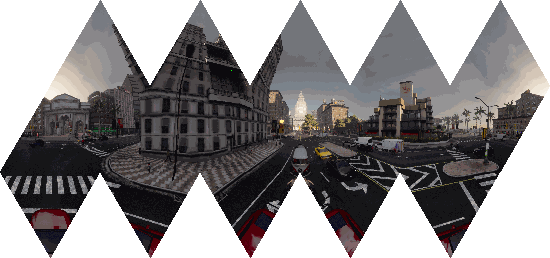

# Unwrapped Icosahedral and Dodecahedral Maps 🗺️
Creating unwrapped polyhedral maps from equirectangular images.
Initial python code for Isocahedral from [rdbch](https://github.com/rdbch/icosahedral_sampler)

Insipration taken from [here](http://www.paulbourke.net/panorama/icosahedral/).
If you find this useful, please consider giving it a star ⭐


## Installation
This code was developed using ```python 3.8```, however it should run on anything that has  >= ```python 3.6```.

To install the requirements, one can simply run:

```bash
$ pip install -r requiremets.py
```

## Usage
2 base classes available:
- ```IcosahedralSampler``` class -- for generating 20 triangular faced polygon
- ```DodecahedralSampler``` class -- for generating 12 regular pentagon faced polygon

Syntax for both classes should be similar

Sample usage:
```python
from poly_sampler import IcosahedralSampler

eq_image = imread('./assets/0.png')
sampler = IcosahedralSampler(resolution = 600)

# generate unwrapped maps (as presented above)
unwrapped_image = sampler.unwrap(eq_image, face_offset=0) # change face_offset to rotation_offset for DodecahedralSampler

# generate unwrapped maps and shift they faces are put into the final panorama
unwrapped_image = sampler.unwrap(eq_image, face_offset=2) # change face_offset to rotation_offset for DodecahedralSampler


# create the image of the triangular face
face_image = sampler.get_face_image(face_no=0, eq_image=eq_image)

# sample face colors from an eq image
face_colors = sampler.get_face_rgb(face_no=0, eq_image=eq_image)

```
One can run the provided sample notebook ([isocahedron](./examples.ipynb) and [dodecahedron](./dode_example.ipynb)) to see exactly how the code works.
One can create shift the output image by specifying the _face_offset_ when calling ```sampler.unwrap()``` or _rotation_offset_ when calling ```sampler.unwrap()```:




## Command line
This repository also contains a command line utility program that can convert an equirectangular image 
to an incosahedral projection map:

```bash
$ python unwrap.py --input=<path to input> \ 
                   --output=<path to output> \
                   --face_resolution=600 \ 
                   --face_offset=0
```

## References

- [rdbch](https://github.com/rdbch/icosahedral_sampler)
- [http://www.paulbourke.net/panorama/icosahedral/](http://www.paulbourke.net/panorama/icosahedral/)
- [https://www.songho.ca/opengl/gl_sphere.html](https://www.songho.ca/opengl/gl_sphere.html)
- [https://en.wikipedia.org/wiki/Regular_icosahedron](https://en.wikipedia.org/wiki/Regular_icosahedron)
- [https://mathworld.wolfram.com/RegularIcosahedron.html](https://mathworld.wolfram.com/RegularIcosahedron.html)
